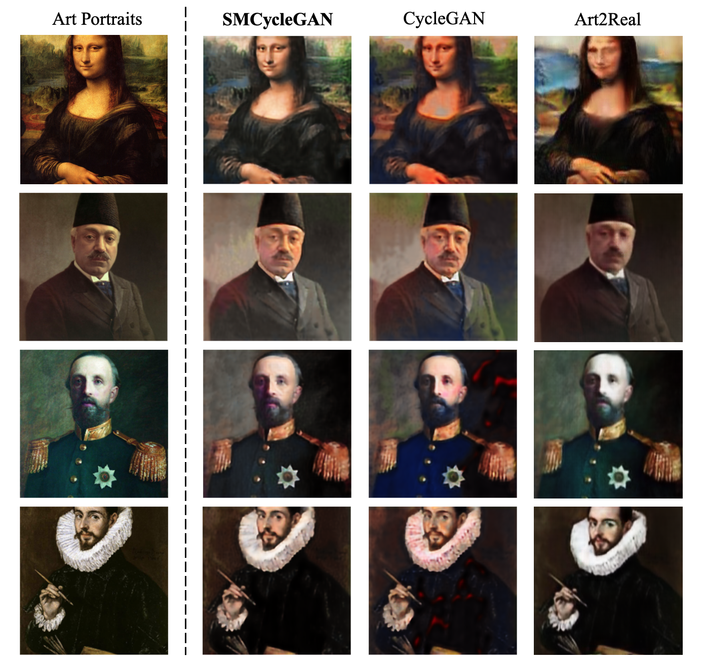

# Semantically-aware Mask CycleGAN (SMCycleGAN)

This repository is for the work of SMCycleGAN, which is built based on [CycleGAN](https://github.com/junyanz/pytorch-CycleGAN-and-pix2pix) and used for translating artistic portraits to photo-realistic visualizations. This model is developed for the course project of COMP4711 in HKUST by YIN Zhuohao. This model is compared with several state of the art models such as [CycleGAN](https://github.com/junyanz/pytorch-CycleGAN-and-pix2pix), [Art2Real](https://github.com/aimagelab/art2real), and has produced much more compelling results, as shown below.

## How to run
To reproduce the results and download pre-trained models, you may check out [this folder](https://drive.google.com/drive/folders/1Q025PjGnAFwQLwl_KoLe-GUT2IqHVN2i?usp=share_link) on Google Drive. It contains datasets, model checkpoints, and generated examples.

## Project report
You may check out the project final report [here](<Semantically-aware Mask CycleGAN for Translating Artistic Portraits to Photo-realistic Visualizations.pdf>). The report is written with the provided template for submission to [CVPR](https://cvpr2022.thecvf.com/).
